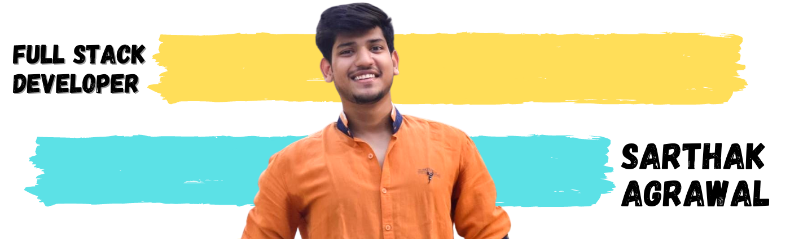

<!--  -->

 

  <samp>
    Hi, I'm Sarthak! 👋  
   🔥 Software Engineer at <a href="https://paytm.com/">Paytm</a> 
    ✨ Favorite Tech: JavaScript, React, Angular, NodeJS, Python ...  
    🤔 I’m looking for help with Docker deployment 
    ❤️ Newly found love in NestJS! 
    ✉️ <a href="mailto:sharthak31@gmail.com">sharthak31@gmail.com </a> 
   🎨 Portfolio: <a target="_blank" href="https://sarthak-agrawal.me">https://sarthak-agrawal.me</a>  
    💼 LinkedIn: <a target="_blank" href="https://www.linkedin.com/in/sarthak-agrawal-a41aa3153/">https://www.linkedin.com/in/sarthak-agrawal-a41aa3153/</a>  
  </samp>

<!--
**sarthakgoenka/sarthakgoenka** is a ✨ _special_ ✨ repository because its `README.md` (this file) appears on your GitHub profile.

Here are some ideas to get you started:

- 🔭 I’m currently working on ...
- 🌱 I’m currently learning ...
- 👯 I’m looking to collaborate on ...
- 🤔 I’m looking for help with ...
- 💬 Ask me about ...
- 📫 How to reach me: ...
- 😄 Pronouns: ...
- ⚡ Fun fact: ...
-->
